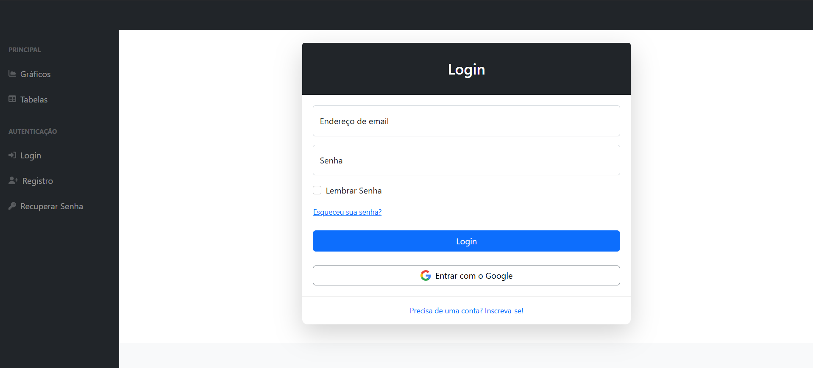
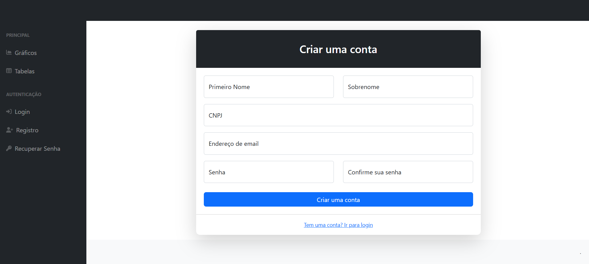
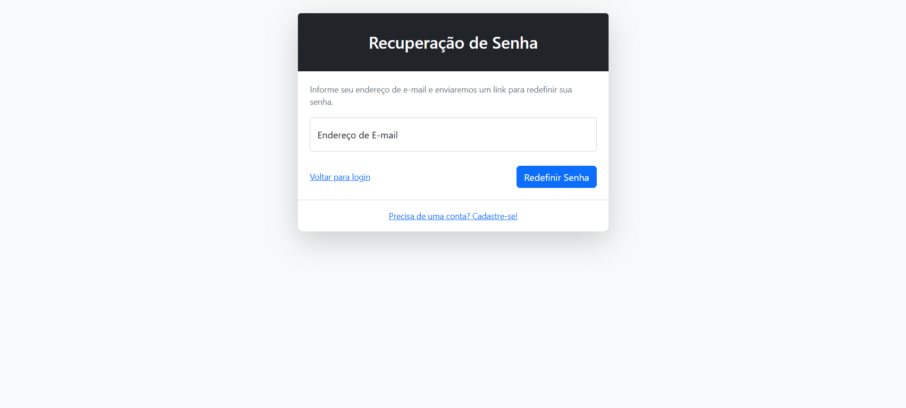
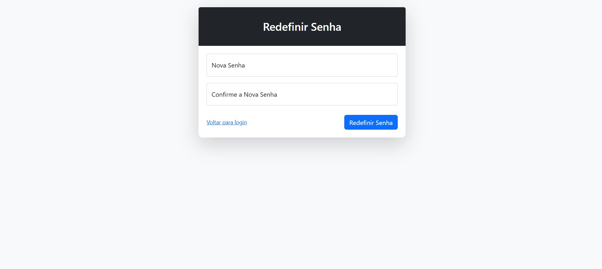
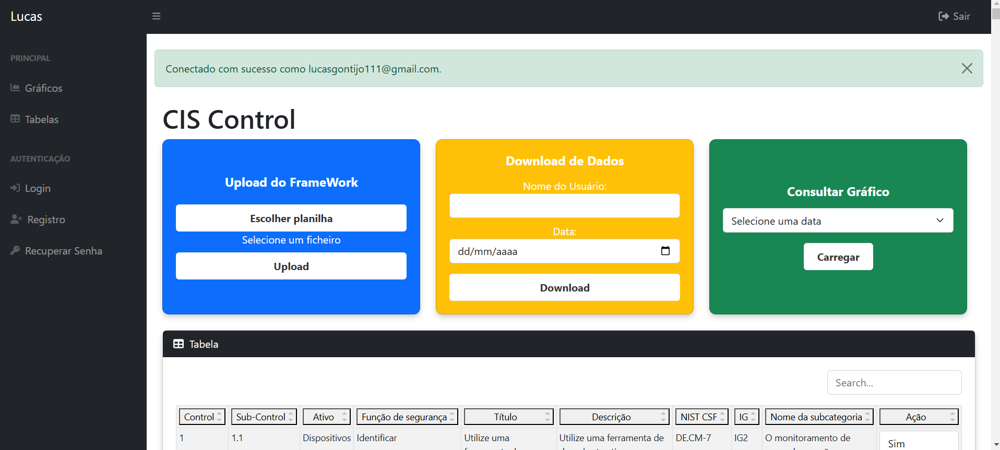
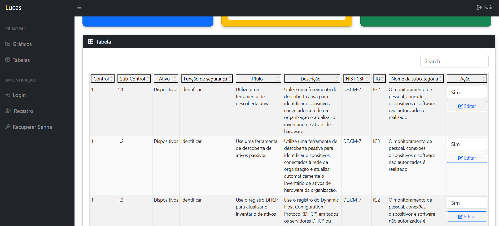
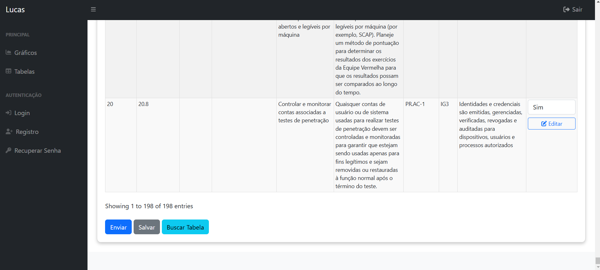
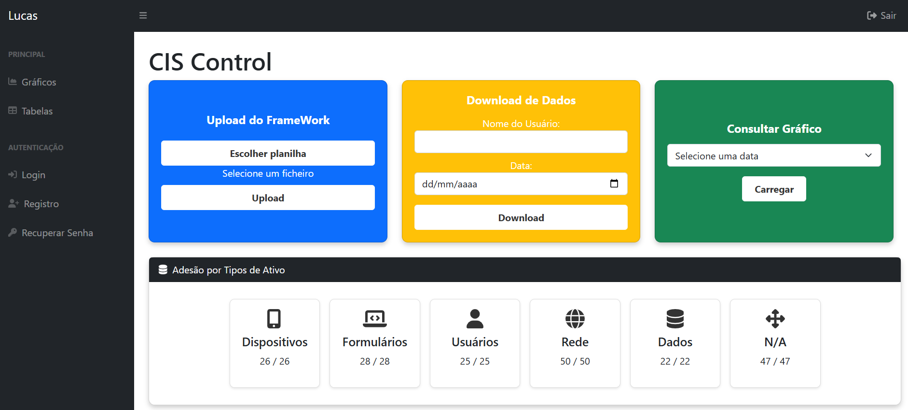
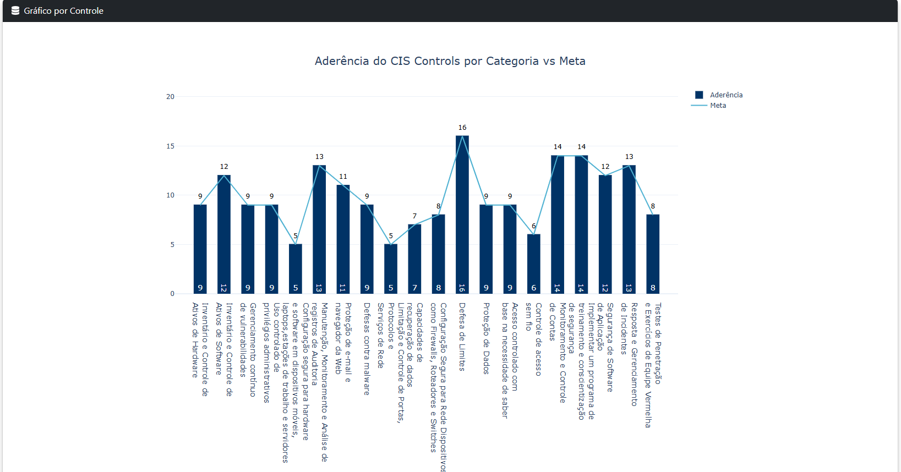
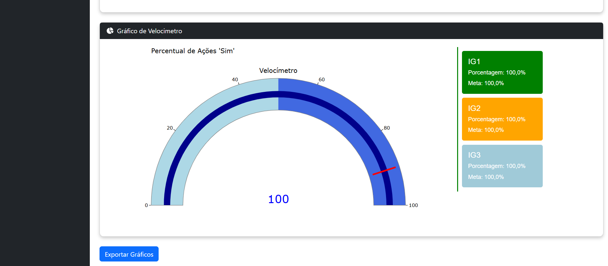

# Iniciação Científica - Aprimoramento de Ferramenta para Automação da Auditoria de Conformidade com o CIS em Sistemas e Redes  

Repositório para a documentação do projeto de Iniciação Científica (IC) no IFMG-Campus Formiga, desenvolvido pelos membros da turma de Ciência da Computação.  

## Equipe  

| **Nome**                    | **Matrícula** | **GitHub**         |  
|-----------------------------|:-------------:|--------------------|  
| Kauan Eduardo da Silveira    | 0077593       | [KauanEdS](https://github.com/KauanEdS) |  
| Lucas Gontijo Rodrigues      | 0077151       | [lucasgontijo13](https://github.com/lucasgontijo13) |  

## GitHub Pages - Desenvolvimento Local  

### Configuração do Ambiente de Desenvolvimento  

1. **Criação da Estrutura do Projeto:**  
   - Crie uma pasta para armazenar os repositórios do projeto.  
   - Insira o repositório dentro dessa pasta.  

2. **Configuração do Arquivo `.env`:**  
   - Crie um arquivo `.env` com base no `exemplo.env`.
   - Substitua o arquivo `exemplo.env` pelo `.env` que acabou de criar e editar.

3. **Instalação do Ambiente Virtual:**  

   - Abra o terminal na pasta do projeto que você criou e execute os seguintes comandos,(Lembrando fora do mysite):  

     **Instale o `virtualenv`:**  
     ```console  
     pip install virtualenv  
     ```  

     **Crie o ambiente virtual:**  
     ```console  
     python -m venv venv  
     ```  

     **Ative o ambiente virtual:**  
     - **Linux/macOS:**  
       ```console  
       source venv/bin/activate  
       ```  
     - **Windows:**  
       ```console  
       venv\Scripts\activate  
       ```  

4. **Instalação das Dependências:**  
   - Navegue até a pasta do projeto:  
     ```console  
     cd mysite  
     ```  
   - Instale as dependências:  
     ```console  
     pip install -r requirements.txt  
     ```  

5. **Configuração do Banco de Dados:**  
   - **Geração do banco de dados:**  
     ```console  
     python createDataBase.py  
     ```  
   - **Aplicação de migrações:**  
     ```console  
     python manage.py makemigrations  
     ```  
     ```console  
     python manage.py migrate  
     ```  

6. **Configurando o Login com Google:**  
   - No terminal, execute o comando:  
     ```console  
     python create_social_account.py  
     ```  

7. **Execução do Servidor:**  
   - No terminal, execute o comando:  
     ```console  
     python manage.py runserver  
     ```  

8. **Acesso ao Projeto:**  
   - Abra seu navegador e acesse: [http://127.0.0.1:8000/](http://127.0.0.1:8000/)  

   
---

## Screenshots do Projeto

A seguir estão algumas imagens do projeto em funcionamento.

### 1. Tela de Login


### 2. Tela de Registro


### 3. Tela de Recuperação de Senha


### 4. Tela para Digitar a Nova Senha


### 5. Tela Inicial Após Login


### 6. Meio da Planilha


### 7. Final da Planilha


### 8. Grafico por Tipo de Ativo


### 9. Grafico por Tipo de Controle


### 10. Grafico de Velocimentro



